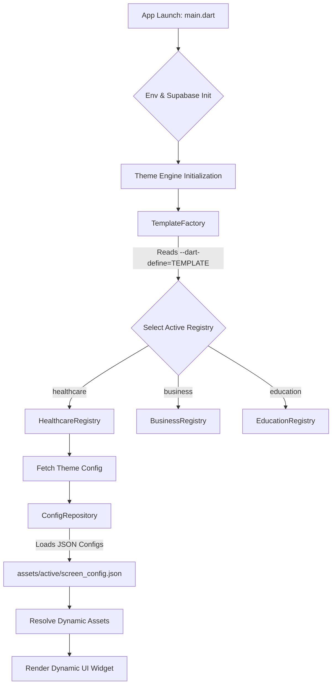

# RapidWeave Project Documentation & Workflow

## 1. Project Overview & Features

RapidWeave is a dynamic, configuration-driven Flutter application that supports multiple distinct application templates (e.g., `healthcare`, `business`, `education`) from a single codebase.

### Key Code Features:
- **Dynamic Config-Driven UI:** UI screens are not hardcoded but are constructed based on JSON configurations loaded at runtime.
- **Template Registry & Factory Pattern:** Uses a `TemplateFactory` and `TemplateRegistry` to define boundaries between different app types. Each template defines its own theme colors, fonts, and specific screen widgets.
- **Build-Time Tree-Shaking:** Uses Flutter's environment variables (`--dart-define`) to strip out unused templates at compile-time to keep the final app size minimal.
- **Dynamic Asset Resolution:** Instead of duplicating image/icon paths, the `ConfigRepository` automatically resolves assets based on the active template.

---

## 2. Core Project Workflow

1. **Initialization (`main.dart`):**
   - The app loads environment variables from `.env` and initializes `Supabase` for backend functionality.
   - It watches `themeConfigProvider` and `themeExtensionProvider` to dynamically build the `MaterialApp` theme based on the active template.

2. **Template Resolution (`TemplateFactory`):**
   - At build time, `--dart-define=TEMPLATE=[id]` sets the `activeTemplateId`.
   - The `TemplateFactory.getRegistry()` returns the specific registry (e.g., `HealthcareRegistry`, `BusinessRegistry`) which contains the logic for building screens (Login, Dashboard, Splash) and the specific theme configuration for that template.
   - In "White-Label" mode (`--dart-define=WHITE_LABEL=true`), unused templates are completely ignored and removed from the final compiled app.

3. **Loading Configurations (`ConfigRepository`):**
   - The app reads `assets/active/theme.json` and `assets/active/[screen_id]_config.json` files.
   - During config loading, `ConfigRepository` checks for keys ending in `image` or `icon` and automatically prefixes them with the active template's asset path (e.g., `assets/images/healthcare/logo.png`).

---

## 3. Architecture Flow Chart



---

## 4. How to Build Using Only Template-Related Folders

RapidWeave achieves dynamic template builds by heavily managing the `assets` folder before Flutter even starts compiling. 

### The Build Manager Script
Located at `tool/build_manager.dart`, this script orchestrates the process.

**Step 1: Prepare Assets**
When you run the build manager, it first clears the `assets/active` directory. It then copies ONLY the common configs and specific template assets into the `assets/active` directory. This ensures the app doesn't bundle unnecessary files from other templates.

**Step 2: Tree-Shaking Execution**
The script then triggers the Flutter build using specific flags:
`flutter build web --dart-define=TEMPLATE=healthcare --dart-define=WHITE_LABEL=true`

By setting `WHITE_LABEL=true`, the `TemplateFactory` is forced to return ONLY the active registry. The Dart compiler recognizes that the other `TemplateRegistry` classes are unreachable and removes them from the final compiled code (Tree-Shaking).

### Build Commands

To build a specific template (e.g., Healthcare for Web):
```bash
dart tool/build_manager.dart build healthcare web
```

To build Business for Android/iOS (if supported):
```bash
dart tool/build_manager.dart build business apk
dart tool/build_manager.dart build business ios
```

If you only want to sync the assets to `assets/active` for local development testing without building:
```bash
dart tool/build_manager.dart prepare healthcare
```

---

> **Note on DOCX Conversion:**
> This document is provided in Markdown (.md) format. To convert this to a `.docx` file for MS Word, you can:
> 1. Use an online converter like [StackEdit](https://stackedit.io/) or [Dillinger](https://dillinger.io/).
> 2. Use a tool like **Pandoc** in your terminal: `pandoc RapidWeave_Workflow_Doc.md -o RapidWeave_Workflow.docx`
> 3. Or simply open this `.md` file in an editor like VS Code, copy the preview, and paste it directly into MS Word.
